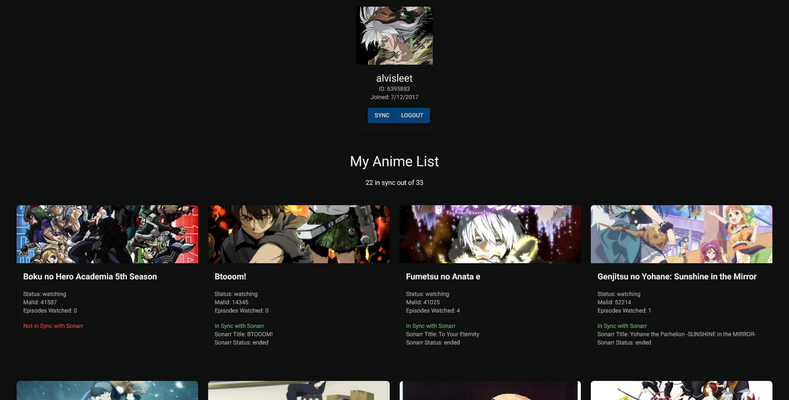

# MyAnimeList Integration for Sonarr


> [!WARNING] 
> This application is currently in beta. Expect bugs and incomplete features. Use at your own risk. :shipit:

This project integrates [MyAnimeList](https://myanimelist.org/) with [Sonarr](https://sonarr.tv/), sort of. By default, it will look for anything that you have on your "Now Watching" watch list on MAL and if TVDB says it is a series that has a genre of Anime or Animation, it will grab its TVDBID and send that to Sonarr. The biggest thing here is that we are giving Sonarr shows a `malId` that allows us to make corellations. It currently DOES NOT start searching immediately for said shows by default. If you want to enable that, you need to change the `searchForMissingEpisodes: false` to true in the `addAnimeToSonarr` function in `updatedUtils.ts`. I refuse to turn this on by default. Please report any issues/feature requests and lets extend this to all anime lists!



## Project requirements
### API Keys
1. Sonarr API Key
    -  **Description**: Key for authenticating with the Sonarr API.
    - **How to Obtain**: Log in to Sonarr, navigate to Settings > General, and find or generate your API key.
2. MyAnimeList API Key
    -  **Description**: Key for accessing the MyAnimeList API.
    - **How to Obtain**: Register your application on the [MyAnimeList Developer Portal](https://myanimelist.net/apiconfig) and obtain your API key.
3. TVDB API Key
    -  **Description**: Key for accessing the TVDB API to retrieve TVDB IDs.
    - **How to Obtain**: Register an account and go to their [api info page](https://thetvdb.com/api-information). You will get a key after filling out the form.
### Dependencies
- Node.js >= 21.0.0
- Postgres
- npm

## Getting Started
### Running the app

1. Clone the repository
```bash
git clone <repository-url>
cd path/to/clone-directory
```
2. Install Dependencies
```bash
npm install
```
3. Set Up Environment Variables
- Copy the example environment file and update the values in .env:
```bash
cp .env.example .env
```
4. Run prisma migrations
```
npx prisma migrate dev
```
5. Start the development server
- Run the Next.js server with HTTPS enabled (experimental):
```
npm run dev-https
```
Open your browser to https://localhost:3000

## API Docuentation
- **Swagger Documentation**: The project includes Swagger for API documentation. You can access it at https://localhost:3000/api-doc. This provides interactive documentation of the API endpoints and their usage.

## App instructions
1. Enter username into textbox and click the two buttons
2. Wait for the synchronization to complete and check the results.


TODO:
- cleanup routing
- Convert `utils.js` to TypeScript
- ~~Write comprehensive instructions~~
- ~~Beautify the README~~
- Clean up AuthContext
- ~~Implement Swagger documentation~~
- Containerize the application
- Create an initialization page to input and store variables in the database
- Load variables from the database
- Add toggle `forsearchForMissingEpisodes`
- Allow user to select what list from MAL they want to pull anime from